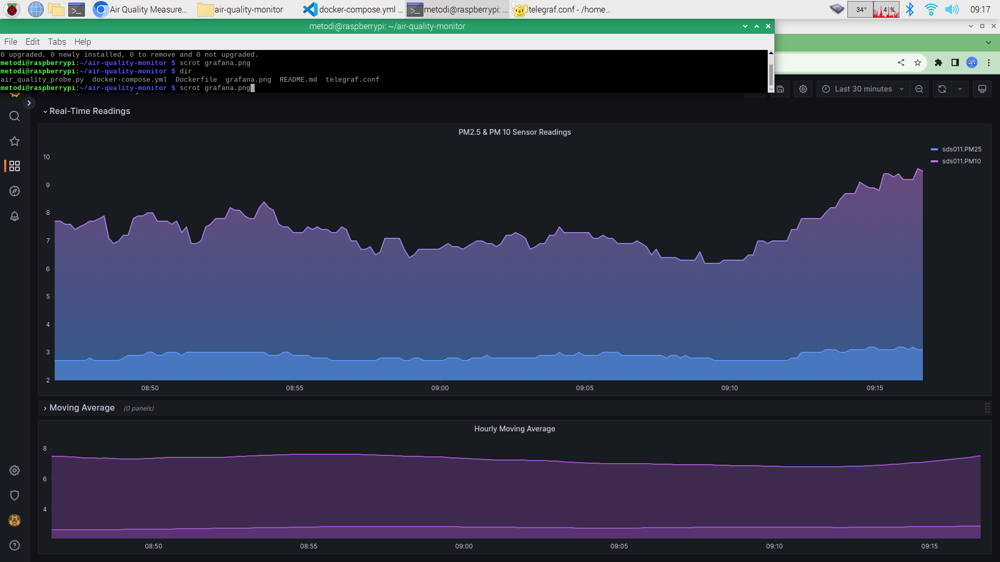

# Raspberry Pi 4 and SDS011 air-quality-monitor

Simple docker setup for Raspberry Pi 4 for a home-made PM 2.5 & PM 10 air quality monitoring system. 

This code is intended to work with sensor SDS011. 

Based on various guides, I find my approach the easiest to implement and with less constraints.

Python dependencies are Python 3.9, and pip packages - influxdb, pyserial, and tenacity.

One specific to this implementation is the version of InfluxDB which for my setup is 1.8. Newer versions of influxdb enter in a reboot loop which I was unable to fix.  I've tried with containers from different architectures such as amd64, arm64v8 & arm32v7 and regardless of the the versions, only 1.8 works.

The deployment includes Chronograf and Telegraf for performance monitoring of the InfluxDB.

air-quality-probe.py appends measurements from the SDS011 sensor into InfluxDB in 10 secon intervals.

Docker-compose.yml contains all interdependencies and settings.

