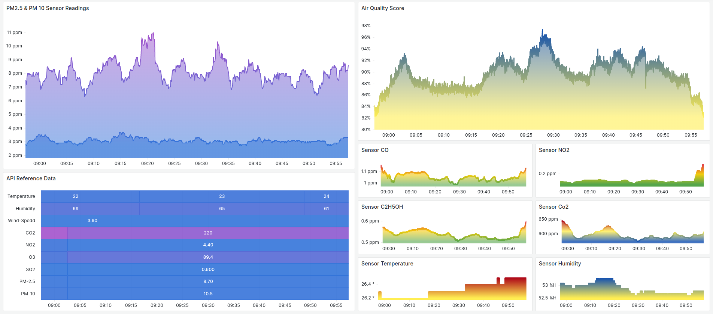
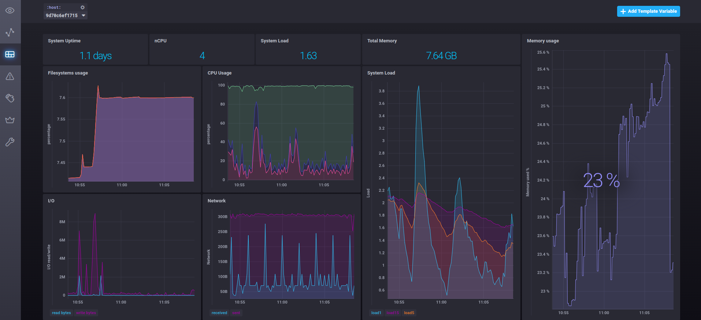
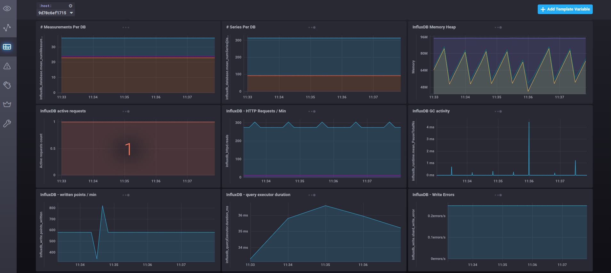

# Raspberry Pi 4 Air Quality Monitor System

Simple docker setup for a home-made PM 2.5 & PM 10, VOC, Co2, CO, NO2, C2H5CH, Temperature, Pressure, and Humidity air quality monitoring system. 

This code is intended to work with Raspberry Pi 4 64bit OS, and the sensors SDS011, BME680, M5Stack CO2L Unit (SCD41) and Grove - Gas Sensor V2(Multichannel).

<pre>
```
project structure:
│   docker-compose.yml
|
└───air-co-voc-no2-c2h5oh-probe
|   |   Dockerfile
│   |   air-co-voc-no2-c2h5oh-call.py
|
└───air-voc-probe
|   |   Dockerfile
│   |   air-voc-probe.py
|
└───air-c02-temp-hum-probe
│   │   Dockerfile
│   │   air-c02-temp-hum-probe.py
|
└───air-quality-probe
│   │   Dockerfile
│   │   air-quality-probe.py
│
└───api_data
    │   Dockerfile
    │   api_data_fetch.py
```
</pre>

# Requirements (deployed as part of the Docker containers): 

  - Python 3.9 
    - pip packages: 
      - influxdb 
      - pyserial
      - tenacity
      - requests
      - smbus2
      - bme680
      - sensirion-i2c-sen5x
      - sensirion-i2c-scd

To install Docker on Raspberry Pi OS:
    - https://phoenixnap.com/kb/docker-on-raspberry-pi
    - curl -fsSL https://get.docker.com -o get-docker.sh
    - sudo sh get-docker.sh
    
    - sudo curl -L "https://github.com/docker/compose/releases/download/v2.1.7/docker-compose-$(uname -s)-$(uname -m)" -o /usr/local/bin/docker-compose
    - sudo apt update
    - sudo apt install code

One specific to this implementation is the version of InfluxDB which for my setup is 1.8. Newer versions of influxdb enter in a reboot loop which I was unable to fix.  I've tried with containers from different architectures such as arm64v8 & arm32v7 and none of them worked.

The deployment spins up the following microservices: 

  - InfluxDB
  - Grafana
  - Chronograf
  - Telegraf
  - Kapacitor
  - air-co-voc-no2-c2h5oh-probe
  - air-co2-temp-hum-probe
  - air-quality-probe
  - api-data-probe
  - air-voc-probe

air-co-voc-no2-c2h5oh-call.py uses the Grove Gas Sensor V2(Multichannel) by Seed Studio (https://wiki.seeedstudio.com/Grove-Multichannel-Gas-Sensor-V2/) and can detect carbon monoxide (CO), Nitrogen dioxide (NO2), Ethyl alcohol(C2H5CH), and Volatile Organic Compounds (VOC). This is the most difficult and problematic sensor to configure for meaningful results. The code I use is adapted from the code of Chuntao Liu (https://github.com/atsclct/atsc_sensors).

air-voc-probe.py uses the BME680 Breakout - Air Quality, Temperature, Pressure, Humidity Sensor (https://shop.pimoroni.com/products/bme680-breakout) to append readings into influxDB in 5 second intervals.

air-co2-temp-hum-probe.py uses the M5Stack (https://shop.m5stack.com/products/co2l-unit-with-temperature-and-humidity-sensor-scd41) sensor to append readings into InfluxDB in 5 second intervals. 

air-quality-probe.py appends measurements from the SDS011 sensor into InfluxDB in 5 second intervals.

api-data-probe.py sources measurements from http://api.weatherapi.com/ and stores them into the InfluxDB container each 5 minutes. This data is used to compare the indoor with outdoor readings.

Setting Grafana with the correct data sources requires the addition of five separate InfluxDB instances. Each of these instances must point to the same InfluxDB container using the URL http://influxdb:8086. Username or password are not required, but each data source has a unique database name corresponding to its respective sensor:

  - api_data
  - bme680_data
  - scd4x_data
  - sds011_data
  - groove_mgs_v2_data

dashboards folder contains the latest export of the JSON model of the Grafana dashboard.

./conf folder contains the configuration plugins for telegraf and kapacitor (required only for the dashboards with system metrics). 

Setting up Chronograf dashboard requires some basic configuration from its GUI accessible at http://localhost:8888

# Latest Grafana dashboard


# Chronograf dashboard of the system utilization


# Chronograf dashboard with InfluxDB metrics
